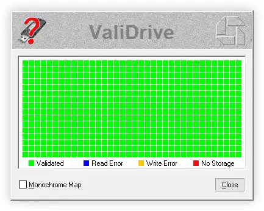
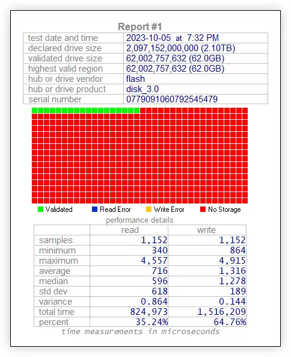

---
# 页面路径
permalinkPattern: 2024/7/2/validrive/

title: ValiDrive - 强大的扩容盘测试工具，快速检测U盘真实容量。
description: 强大的扩容U盘检测工具，SSD、U盘读写可靠性扩容测试工具，轻松鉴定实际容量，真实容量鉴定神器。
tags: ["好用小软件"]
star: true

# 启用评论评论
comment: true
---

# ValiDrive - 强大的扩容盘测试工具，快速检测U盘真实容量。

## 扩容U盘例子

上图中的U盘是市面上泛滥的扩容盘。一款声称具有2TB的U盘，实际上仅拥有62GB的存储空间。

## 这为什么是一个严重的问题？
你可能以为这是一个小问题，只是以超低价格购买了一个1T或2TB的U盘，结果收到的是64GB的而已。但事实并非如此！

这个U盘看起来是1T或2TB的U盘。你将它插入电脑，显示的容量也是是1T或2TB。你甚至可以向U盘中拷文件。当你查看U盘文件列表时，显示一切正常。但是你的文件的内容可能没有被保存，当你打开这个文件时会显示**文件损坏**！

这些扩容U盘的真实存储空间通常是64GB，这些容量足够用来保存文件列表，但是一旦64GB全部用完，之后拷贝进去的文件看起来被保存了，它们的名称、日期和大小将被存储在U盘前部分64G中，看起来这些文件没有问题，但是文件的内容都是空的，因为他们被存储在不存在的地方。

操作系统不会验证它们写入的数据是否真的被写入了。它们需要存储设备的诚实的反馈错误。如果发生写入错误，那么操作系统将在其他地方重写数据。但是这些U盘故意不反馈这些写入错误，他们把这些写入到没有存储空间的数据丢掉了。

::: important
当你发现问题的时候往往是你开始读取文件时发现这些文件都错误了，
看起来一切正常，但是文件全是空的。
:::

## ValiDrive 是怎么工作的？
ValiDrive 在会对U盘的全部空间进行快速的随机读写检查，验证对每个位置写入随机数据数据并验证是否有被正确存储。

::: tip

一个正常的U盘检测结果应该是这样的。希望您的检测结果也是这样，而不是像上面那样。
:::

## ValiDrive 还会生成报告哦

ValiDrive在检查你的U盘时，还会记录每次随机读写访问所需的时间。
之后，它会分析并生成U盘的统计数据，显示在报告中

## 下载

ValiDrive是国外大佬开发的一个小工具，这是他的官网:

[https://www.grc.com/validrive.htm](https://www.grc.com/validrive.htm)

::: tip
你可能找不到下载按钮，这里附上截图，其实我也找了好久awa

:::

