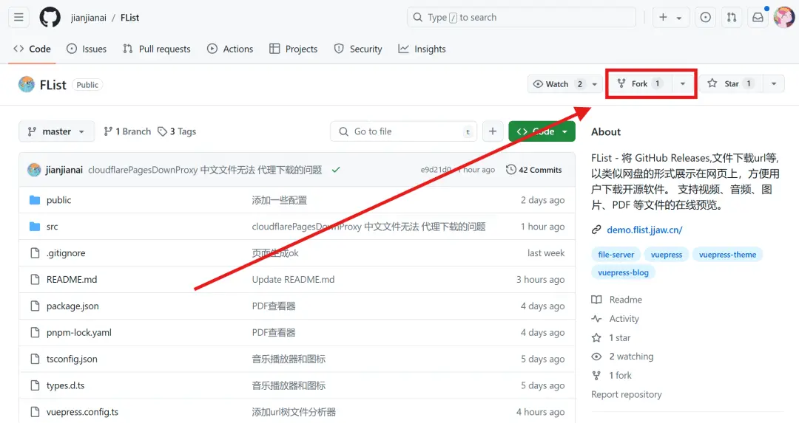

---
# 页面路径
permalinkPattern: 2024/8/3/flist-edit-config/

title: FList - 使用趁手的工具编辑配置文件
star: false

# 启用评论评论
comment: true
---

# 使用趁手的工具编辑配置文件
在编辑配置文件之前，首先需要 Fork 此仓库。

不知道如何 Fork ? 点击展开查看。

---

## 使用在线IDE编辑器修改(最推荐！没门槛)
- 🎉 修改效果实时预览
- 🎉 编辑器检查配置文件是否正确(有代码提示)
- 🎉 无需下载运行环境，在线编辑(只需一个浏览器)

[-> 点击前往 <-](./4-编辑配置文件/0-在线IDE编辑器修改.md)

## 直接在GitHub上修改
- 🎉 方便快捷
- 😞 容易写错配置文件(没有代码提示)
- 😞 无法预览

[-> 点击前往 <-](./4-编辑配置文件/2-GitHub.md)

## 下载代码本地修改(需要熟悉开发流程)
- 😞 需要学习很多开发相关的知识(有很多)
- 😞 需要下载和配置很多环境(很麻烦)

[-> 点击前往 <-](./4-编辑配置文件/1-本地修改.md)

