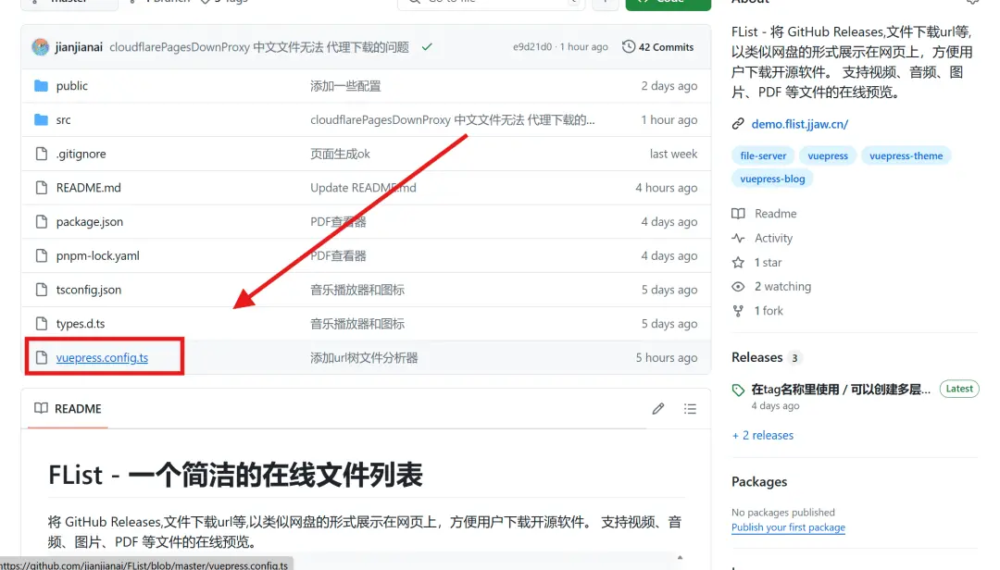
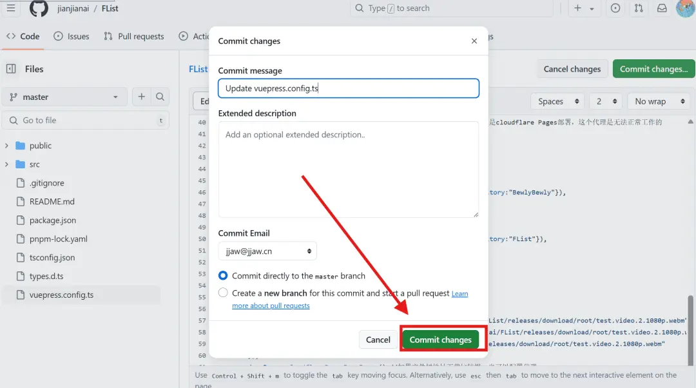

---
# 页面路径
permalinkPattern: 2024/8/3/flist-online-git-hub/

title: FList - GitHub编辑配置文件
star: false

# 启用评论评论
comment: true
---

# GitHub编辑配置文件
- 🎉 方便快捷
- 😞 容易写错配置文件(没有代码提示)
- 😞 无法预览

## 详细教学
在自己Fork的仓库打开配置文件

点击编辑按钮

编辑好之后点击提交

## 下一步
- [-> 了解配置文件写法](../5-了解配置文件的写法.md)