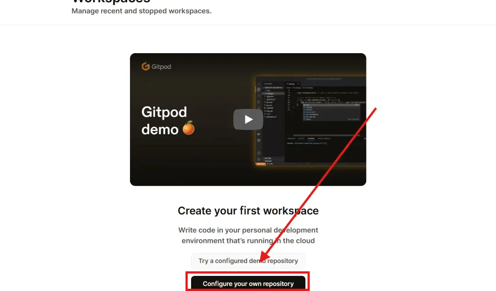
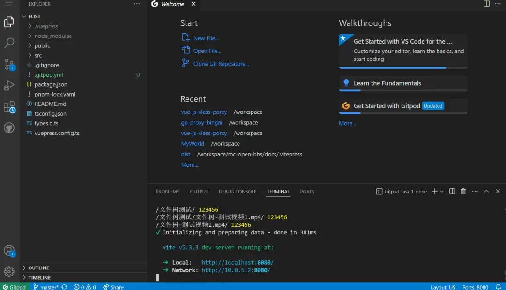
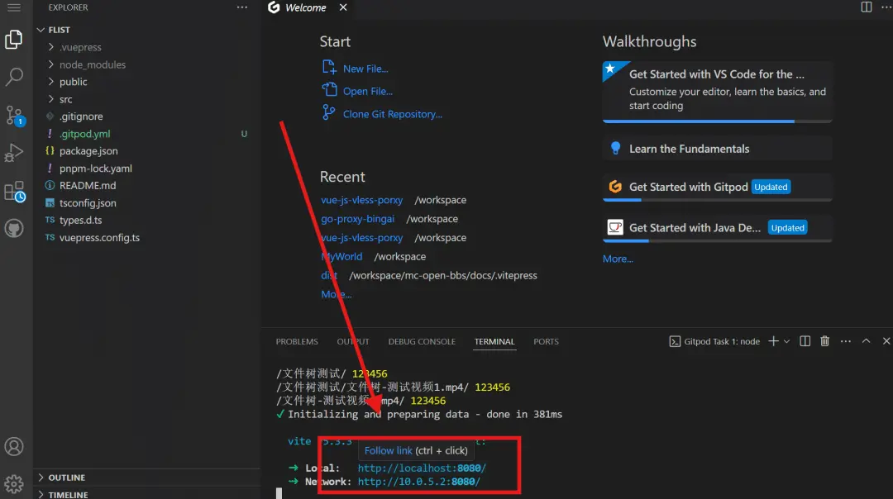
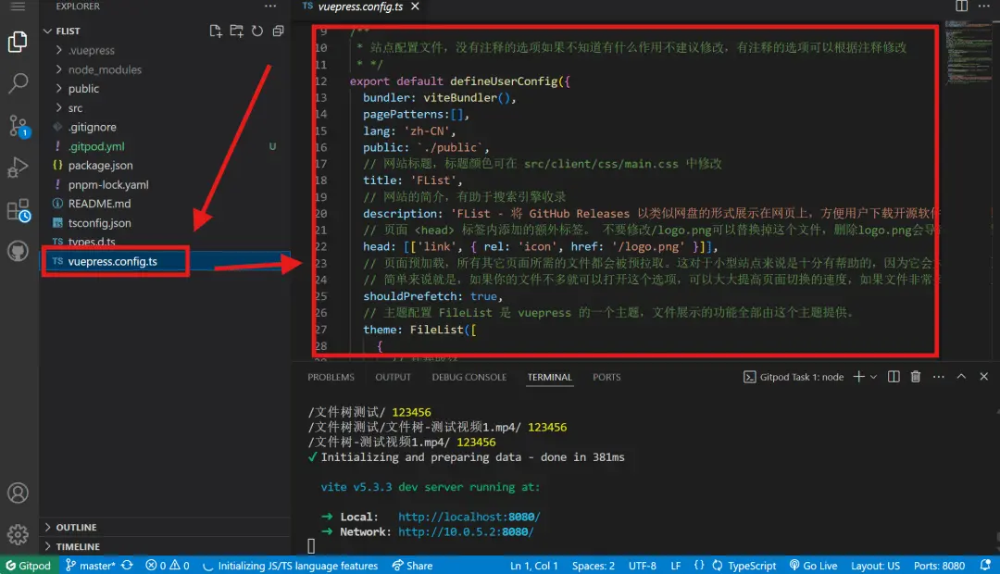
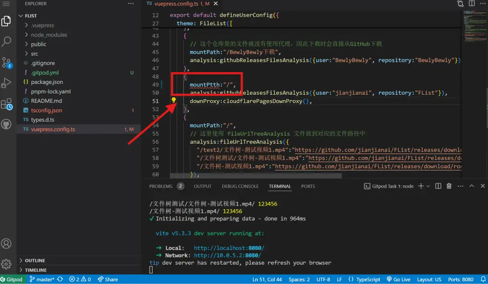
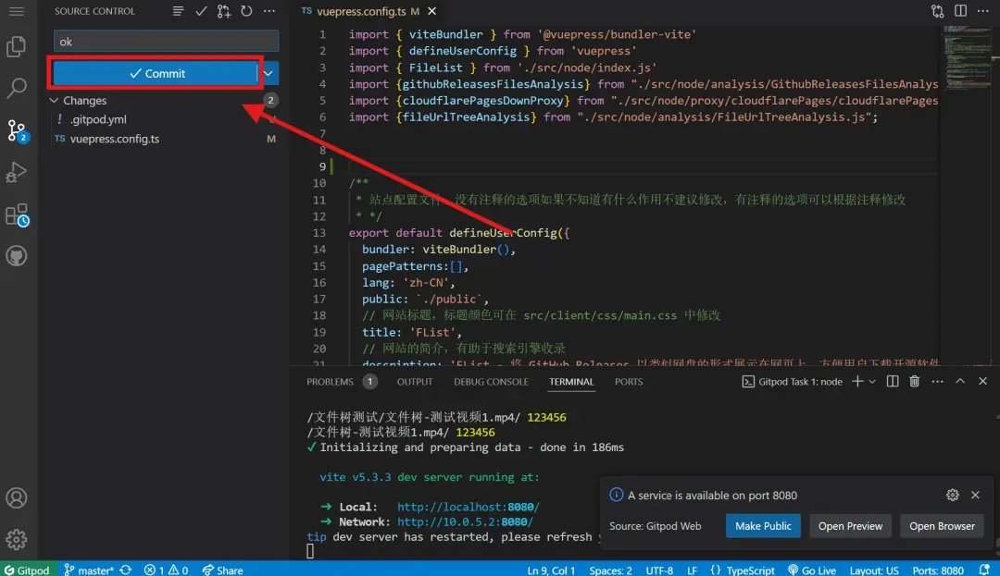
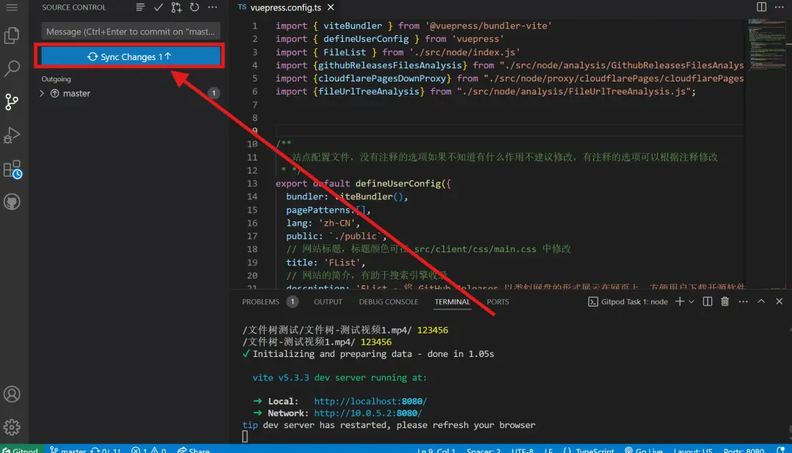

---
# 页面路径
permalinkPattern: 2024/8/3/flist-online-gitpod/

title: FList - Gitpod编辑配置文件
star: false

# 启用评论评论
comment: true
---
# Gitpod编辑配置文件
- 🎉 代码在远程运行，项目秒加载。GitHub秒推送。
- 😞 编辑器有延迟。
- 😞 对 GitHub 账号有限制，没记错应该是注册满6个月才能使用。也许现在没限制了。

## 详细教学
打开 Gitpod 主页 [https://gitpod.io/](https://gitpod.io/)

使用 GitHub 登录

选择 Fork 的仓库

打开仓库，很快就加载好了

按住 ctrl 点击链接可以打开新标签页预览

点击打开配置文件即可开始编辑

注意红色的波浪线，这表示你的配置文件格式写错了，错误的配置文件会导致网页无法构建。下图的 mountPath 拼错了一个字母，被编辑器检查出来了。

编辑完成后提交文件

提交之后再次点击即可将文件同步到 GitHub

## 下一步
- [-> 了解配置文件写法](../5-了解配置文件的写法.md)