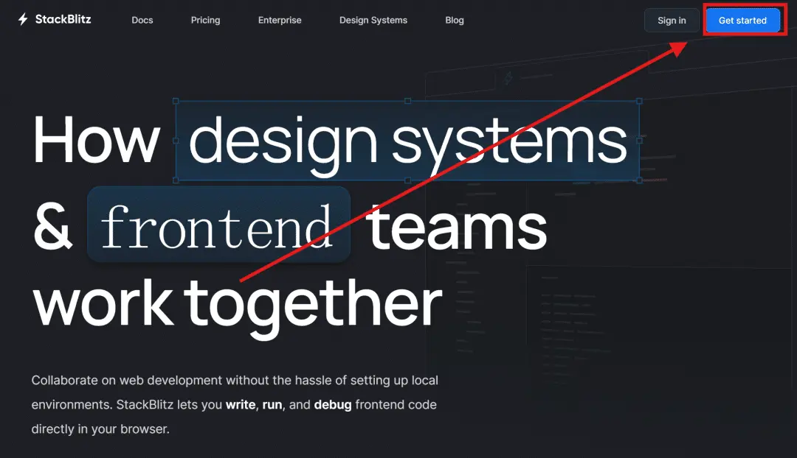
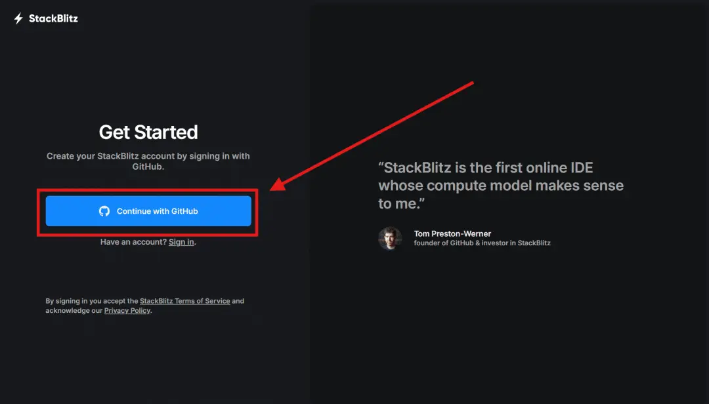
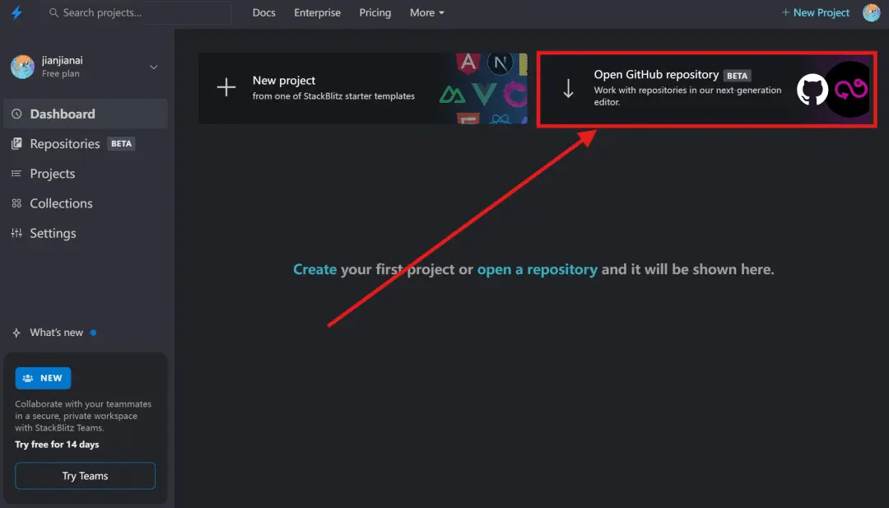
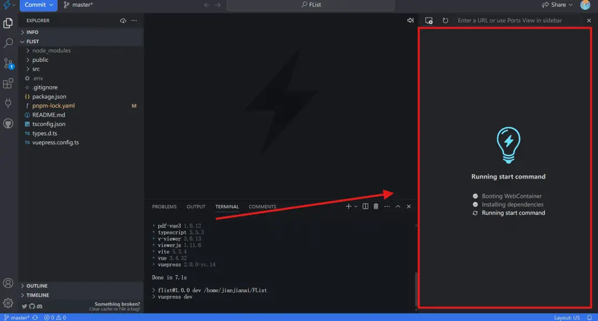
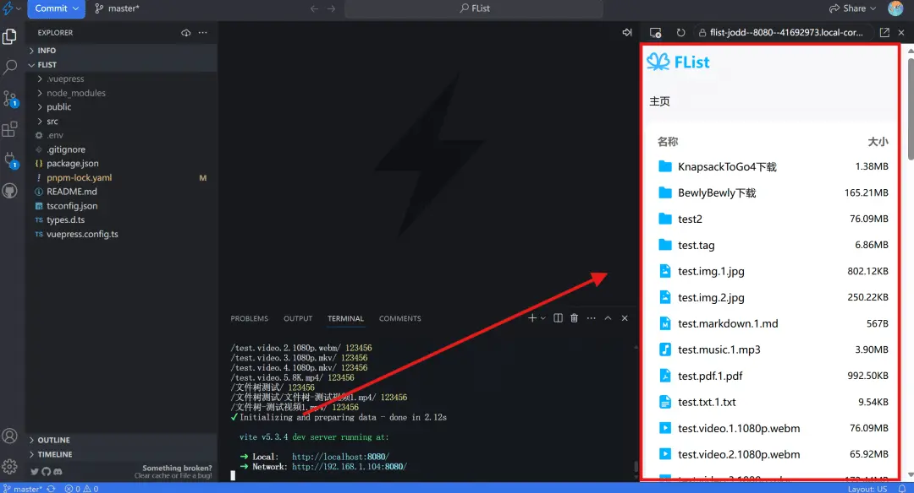
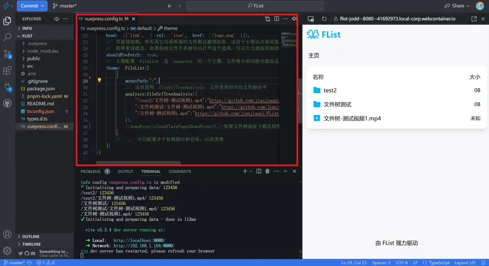
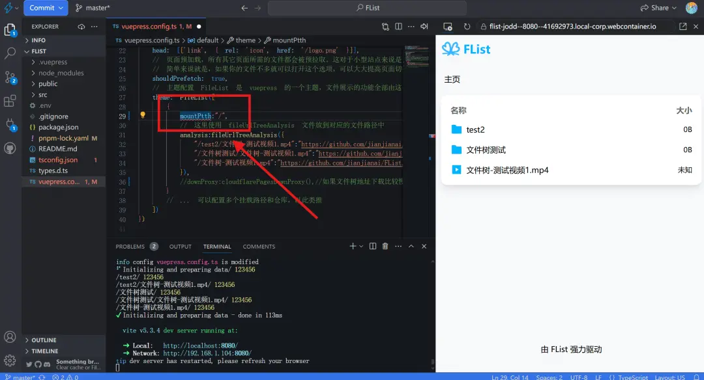

---
# 页面路径
permalinkPattern: 2024/8/3/flist-online-stack-blitz/

title: FList - StackBlitz编辑配置文件
star: false

# 启用评论评论
comment: true
---

# StackBlitz编辑配置文件
- 🎉 本地运行，编辑器无延迟
- 😞 由于在本地运行 GitHub 访问较慢的小伙伴可能需要多次刷新才能加载成功。
- 😞 由于浏览器限制，无法预览配置了代理的文件
- 😞 由于在本地运行，推送编辑好的文件到 GitHub 可能失败，需要多次尝试。

## 详细教学

打开 StackBlitz 的主页 [https://stackblitz.com/](https://stackblitz.com/)

等等项目加载，如果右边的等等部分出现红色则可能是因为网络原因失败了，这个时候刷新网页，重新加载。

直到右边出现预览则成功 (因为 StackBlitz 是运行在浏览器上的所以配置了代理的文件无法预览)

打开配置文件编辑。

编辑好后按 Ctrl+S 保存当前文件即可马上预览效果。

注意红色的波浪线，这表示你的配置文件格式写错了，错误的配置文件会导致网页无法构建。下图的 mountPath 拼错了一个字母，被编辑器检查出来了。

编辑完成之后就可以将文件推送到GitHub上了

## 下一步
- [-> 了解配置文件写法](../5-了解配置文件的写法.md)