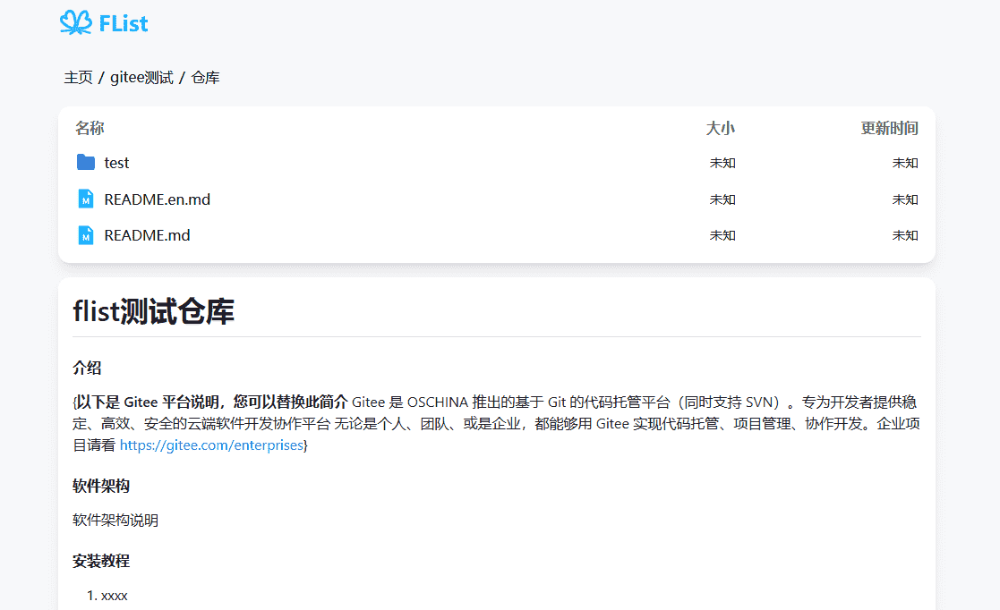

---
# 页面路径
permalinkPattern: 2024/8/3/flist-config-mount-hugging-face-fatasets/

title: FList - 挂载 Hugging Face Datasets
star: false

# 启用评论评论
comment: true
---
# 挂载 Hugging Face Datasets
将 Hugging Face 的 Datasets 挂载到 FList 上


## 配置方法

将用户 ```Open-Orca``` 的 ```OpenOrca``` 数据集的 ```main``` 分支挂载到 ```/huggingface测试``` 下

huggingFaceDatasetsAnalysis参数
- userName 用户名
- datasetsName 数据集名称
- branchName 分支名称
- maxDeep 最大深度,如果文件夹有很多层最大递归解析多少层，默认10

``` typescript
{
  mountPath:"/huggingface测试",
  analysis:huggingFaceDatasetsAnalysis({
    userName:"Open-Orca",
    datasetsName:"OpenOrca",
    branchName:"main",
    //最大深度,如果文件夹有很多层最大递归解析多少层，默认10
    maxDeep:3
    //path:"/test" //数据集的某文件夹，只挂载这个文件夹
    // hideReadme: true, //隐藏README.MD文件
  }),
}
```
## huggingFaceDatasetsAnalysis 特性

### 将文件夹中的 README.MD 文件显示在文件夹的简介区
如果当前文件夹中有 README.MD 文件，则会将 README.MD 文件 显示在文件夹的简介区。



## 最佳实践

### 关于下载代理
Hugging Face 在国内的已被墙，必须配置下载代理才能使用。
Hugging Face 许跨域，所以，PDF，TXT，这些文件也都可以预览，如果只在国外访问，则无需配置下载代理。


## 下一步
- [-> 配置下载代理](../3-代理.md)
- [-> 部署到自己喜欢的平台](../../6-部署到自己喜欢的平台.md)
