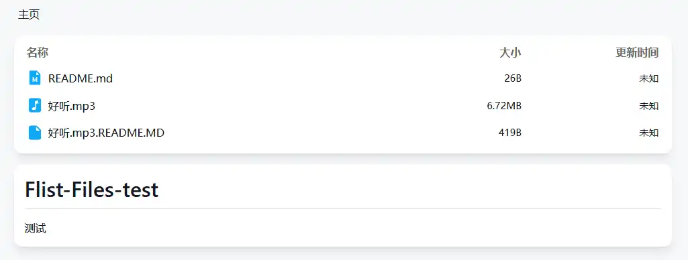
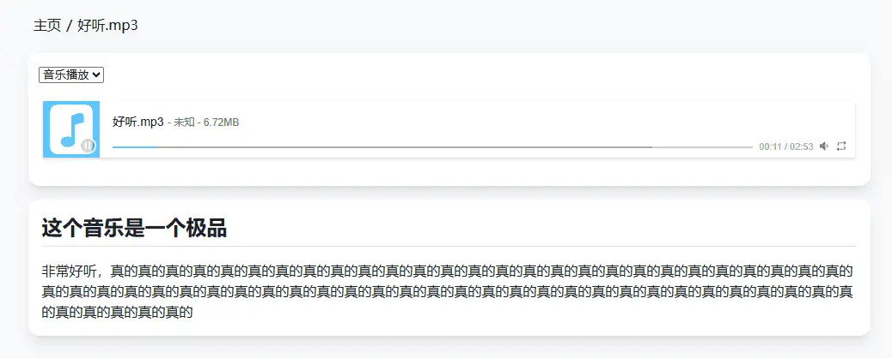

---
# 页面路径
permalinkPattern: 2024/8/14/flist-config-mount-git-hub-Repos/

title: FList - 挂载 GitHub Repos
star: false

# 启用评论评论
comment: true
---
# 挂载 GitHub Repos
将 GitHub Repos 挂载到 FList 上

## 配置方法
将 ```Aikoyori``` 的 ```ProgrammingVTuberLogos``` 仓库挂载到根目录 ```/``` 下

- mountPath: 挂载路径,就是将文件源中的文件放到什么路径下
- analysis: 文件源分析器，这里使用的是 ```githubReposAnalysis```，用于解析 GitHub Repos 中的文件
``` typescript
{
  mountPath: "/ProgrammingVTuberLogos",
  analysis: githubReposAnalysis({
    user: "Aikoyori",
    repository: "ProgrammingVTuberLogos",
    // rootPath: string, //根路径,挂载仓库的路径
    // authorizationToken: string, //github token
    // ref: string, //github分支
    // maxDeep: number, //最大深度,默认10
    // hideReadme: true, //隐藏README.MD文件
  }),
}
```

这样就把 ```Aikoyori``` 的 ```ProgrammingVTuberLogos``` 仓库挂载到了根目录 ```/``` 下了。


## githubReposAnalysis 特性

### 将文件夹中的 README.MD 文件显示在文件夹的简介区
如果当前文件夹中有 README.MD 文件，则会将 README.MD 文件 显示在文件夹的简介区。


### 将相同文件名 .README.MD 结尾的文件现在在简介区
例如有两个文件 ```A.exe``` ```A.exe.README.MD``` 在同一个文件夹中，则会将 ```A.exe.README.MD``` 的内容显示在 ```A.exe``` 文件的简介区。







## 最佳实践

### 关于下载代理
如果直接从GitHub下载速度可能不佳。 

并且由于跨域的原因，PDF，TXT，这些文件无法预览，只能下载。（视频图片音频可以预览）。

**建议配置下载代理,** 可以加速下载和解决跨域问题。

### .README.MD 文件太多影响观感
可以使用 hideReadme 选项将这些文件隐藏掉。
``` typescript
{
  .....
  analysis: githubReposAnalysis({
    .....
    hideReadme: true, //隐藏README.MD文件
  }),
}
```

## 下一步
- [-> 配置下载代理](../3-代理.md)
- [-> 部署到自己喜欢的平台](../../6-部署到自己喜欢的平台.md)