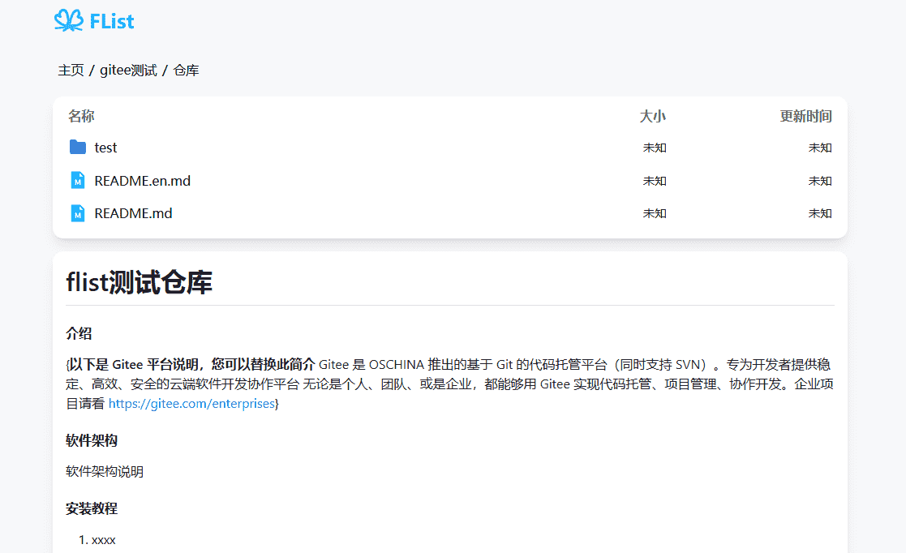
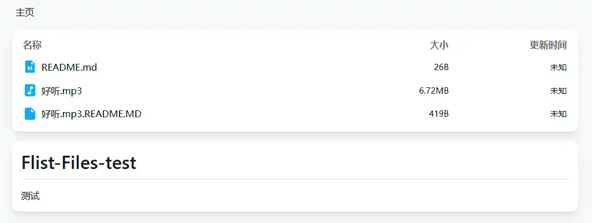
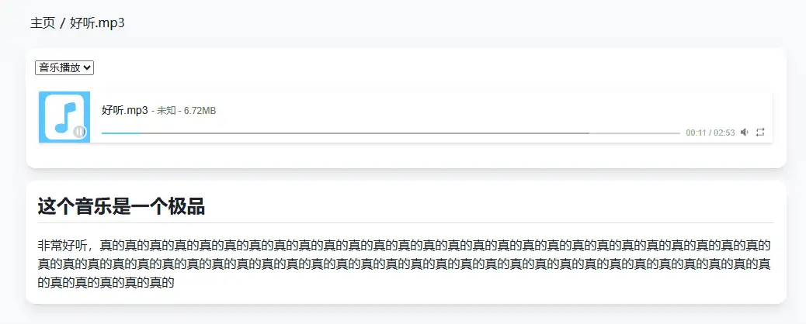

---
# 页面路径
permalinkPattern: 2024/8/14/flist-config-mount-git-hub-Repos/

title: FList - 挂载 GitHub Repos
star: false

# 启用评论评论
comment: true
---
# 挂载 GitHub Repos
将 GitHub Repos 挂载到 FList 上

## 配置方法

例如：将 `Aikoyori/ProgrammingVTuberLogos` 挂载到 `/ProgrammingVTuberLogos`

文件：`mounts/ProgrammingVTuberLogos.json`

```json
{
  "analysis": {
    "type": "githubReposAnalysis",
    "options": {
      "user": "Aikoyori",
      "repository": "ProgrammingVTuberLogos",
      "ref": "main",
      "maxDeep": 5
    }
  },
  "downProxy": {
    "type": "cloudflarePagesDownProxy"
  }
}
```

## 参数说明
`analysis.type = githubReposAnalysis`

- `user`：GitHub 用户名或组织名（必填）
- `repository`：仓库名（必填）
- `rootPath`：仓库内起始目录（可选）
- `authorizationToken`：GitHub Token（可选）
- `ref`：分支 / 标签 / 提交（可选）
- `maxDeep`：最大递归深度（可选，默认 10）
- `hideReadme`：是否隐藏 README 文件（可选）

`authorizationToken` 支持环境变量对象写法：

```json
{
  "analysis": {
    "type": "githubReposAnalysis",
    "options": {
      "user": "your-name",
      "repository": "your-repo",
      "authorizationToken": {
        "$env": "GITHUB_TOKEN"
      }
    }
  }
}
```


## githubReposAnalysis 特性

### 将文件夹中的 README.MD 文件显示在文件夹的简介区
如果当前文件夹中有 README.MD 文件，则会将 README.MD 文件 显示在文件夹的简介区。



### 将相同文件名 .README.MD 结尾的文件现在在简介区
例如有两个文件 ```A.exe``` ```A.exe.README.MD``` 在同一个文件夹中，则会将 ```A.exe.README.MD``` 的内容显示在 ```A.exe``` 文件的简介区。







## 最佳实践

### 关于下载代理
如果直接从GitHub下载速度可能不佳。 

并且由于跨域的原因，PDF，TXT，这些文件无法预览，只能下载。（视频图片音频可以预览）。

**建议配置下载代理,** 可以加速下载和解决跨域问题。

### .README.MD 文件太多影响观感
可以使用 hideReadme 选项将这些文件隐藏掉。
```json
{
  "analysis": {
    "type": "githubReposAnalysis",
    "options": {
      "user": "your-name",
      "repository": "your-repo",
      "hideReadme": true
    }
  }
}
```

## 下一步
- [-> 配置下载代理](../3-代理.md)
- [-> 部署到自己喜欢的平台](../../6-部署到自己喜欢的平台.md)